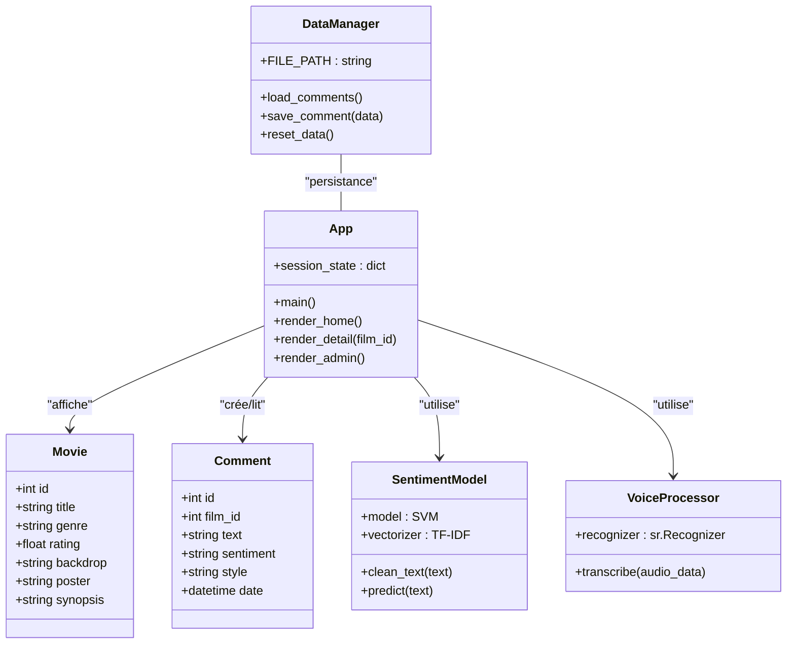
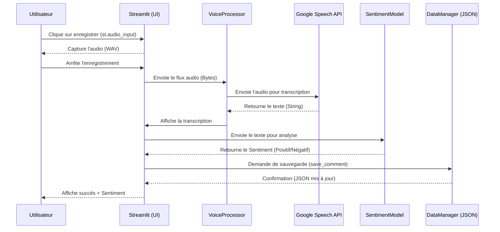

# Diagrammes UML - Projet CineStream

Ce fichier contient les diagrammes UML du projet CineStream (Analyse Multimodale de Sentiments). Les diagrammes sont au format Mermaid.

## 1. Diagramme de Cas d'Utilisation
Ce diagramme illustre les interactions entre les acteurs (Client, Administrateur) et les fonctionnalités du système.

```mermaid
useCaseDiagram
    actor "Utilisateur (Client)" as Client
    actor "Administrateur" as Admin

    package "Système CineStream" {
        usecase "Parcourir le catalogue" as UC1
        usecase "Voir les détails d'un film" as UC2
        usecase "Laisser un avis écrit" as UC3
        usecase "Enregistrer un avis vocal" as UC4
        usecase "Analyse de sentiment auto" as UC5
        usecase "Consulter les statistiques" as UC6
        usecase "Gérer/Réinitialiser les données" as UC7
    }

    Client --> UC1
    Client --> UC2
    Client --> UC3
    Client --> UC4
    
    UC3 ..> UC5 : <<include>>
    UC4 ..> UC5 : <<include>>

    Admin --> UC6
    Admin --> UC7
```

---

## 2. Diagramme de Classe
Ce diagramme décrit la structure statique du code, incluant les entités et les relations logiques.



---

## 3. Diagramme de Séquence (Avis Vocal)
Ce diagramme montre l'interaction dynamique entre les composants lors de l'enregistrement d'un avis vocal.


